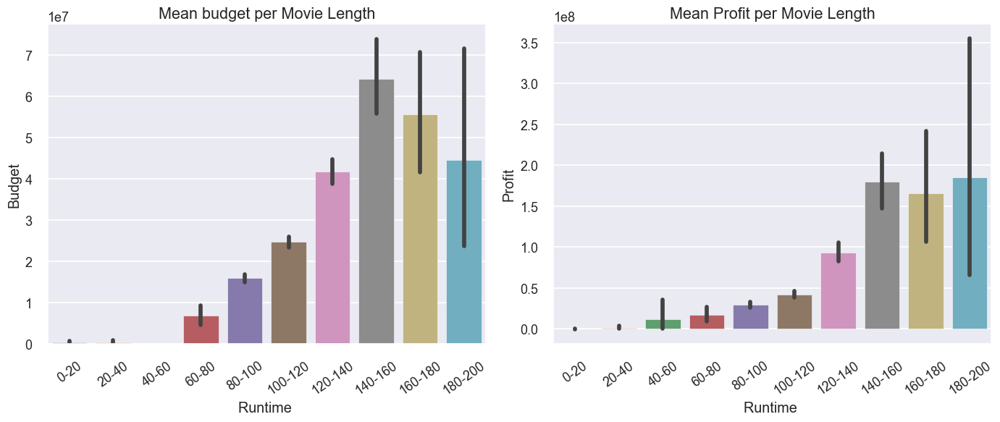

## Movie Analysis

#### Overview
  This analysis is for a film making company that wants to emerge best at the box office. This analysis will help this company to know what features of the TMDB database to put in consideration in order to be more profitable.This analysis will focus on Genres,Release_Date,Revenue,Budget,Production_Companies,Runtime columns.

#### Business Problem
- A film making company has not been performing well  at the box office. The company needs guidance on how to improve on their performance in order to emerge best at the box office.

- Indentify factors of success of the industry

#### Data Understanding
For this analysis I will be using TMDB_7000_Top_Rated_Movies and TMDB_10000_Popular_Movies datasets from Kaggle. The two datasets have a total of 44 columns.This is the link to Kaggle [link here](https://www.kaggle.com/datasets/ritayandhara/tmdb-dataset)

#### Results

- Results showing the most profitable genre

- Results showing as budget and the Revenue increases a movie company is likely have more success

- Results of the most profitable genre that is highly budgeted for.

-Results showing the top 5 most rated movie Genres

- Results showing the best month to produce films

- Results of the most profitable producing Company
 

- Results showing the runtime that will maximize on profit
 

#### Conclusion
Final recommendation for the film making company:
  1. **Genres**
   - Low budget
   I will recommend the film company to focus on 'Fantasy | Romance | Family',then followed by 'Adventure | Fantasy | Mystery' .Where fantasy appears in all the three genres
   - High budget
   I will recommend the film company to focus on 'Fantasy | Adventure | Animation | Comedy | Family'genre which is highly budgeted for and earns a lot of profit and also 'Action | Adventure | Fantasy |Romance |Family'*

   - Rating
  According to rating i will recommend the company to focus on  Adventure | Animation |Comedy | Fantasy | Music | Science Fiction |Family | Tv Movie then followed by Fantasy | Drama |Crime genres

  2. **Release_Date(Release_Month)**
   - Month
   I will recommend the film company to start releasing their films in the month of june then May because they are the most profitable months 

  3. **Runtime**
   - If we focus on runtime the most profitable interval which would maximize profit is 140-160 min.which is 2hrs 20minutes

  4. **Production Companies**
   - I will recommend the company to partner with Dune Entertainment | Lightstorm Entertainment | 20th Centuary Fox | Ingenious Media which are the making the most profitable film making companies
  
  5. **Original Language**
   - I will recommend company to focus on English when they are making the films but does not mean the company should not produce films that other languages are spoken

**Next Step**
Further analyses could yield additional insights to further improve operations at the film making company:
- Priority on this analysis is based on relationship among the  Top_10 genres, Ratings, Best Month,Runtime and Production   Companies.
- Conduct analysis on a related dataset to find other recomendations for the film making to improve analysis of the company
- Marketing plays a big part in movie sucess.Examing this data could give insights on how audiences respond to different       marketing techniques when promoting a movie.
